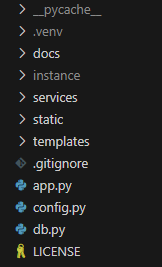

# App Structure
## The structure of my WebApp goes as follows:

## 01: Folder - Instance 
This Folder contains the Files the WepApp has created during its running instance. 
In this particular case, this folder is being populated by the .sqlite file serving as the database. This file is created upon running the `init-db` command´.

## 03: Folder - Services
This Folder contains helper classes that i have decided to offload from the main app.py file. As of right now, it contains some logic to generate mock data for testing. 

## 04: Folder - Static
As of right now, this folder only contains the AI-generated logo of the WebApp.

## 05: Folder - Templates
This folder contains all the HTML filed, which themselves contain some CSS and a pretty extensive amout of JavaScript. 

## 06: File - .gitignore
This files specifies what is supposed to be tracked within the git repository.

## 07: File - app.py
This is the main app with all the business logic associated within the WebApp such as routing, creation and deletion of the database, integration of flask-login and so on. For more info on this part, see Reference. 

## 08: File - config.py
This file has 2 Classes of different configs. This makes sure we can switch from devConfig to a testing config within app.py

## 09 File - db.py
In this file, we are creating the Models SQL-Alchemy. This also represents our data model. 

