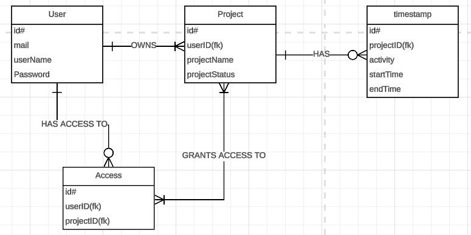

{: .label }
He Wang

# Data Model

## Data Model Description 

### User
 The table User stores all the relevant data of the user
- `id`: primary key, identifies the user
- `mail` : e-mail-adress of the user
- `userName` : desired username to be shown in the app
- `password`: hashed password

### Project
 The table Project stores all info for a given project
- `id`: primary key, unique identifier for the project
- `userID` : foreign key (User.id), represents the owner/creator of the project
- `projectName` : desired name for the project
- `project status`: has no use as of right now, but can be used to archive projects in the future

### Timestamp
This table stores all timestamps 
- `id`: primary key, unique identifier for a timestamp
- `projectID`: foreign key (Project.id), shows which project the timestamp belongs to
- `activity`: stores the tags entered by the user
- `startTime`: time when the user presses start
- `endTime`: time when the user presses stop

### Access
This table stores all the collaborators who have access to a give project
- `id` : primary key, unique identifier for a entry
- `userID`: foreign key (User.id)
- `projectID`:foreign key (Project.id) 
