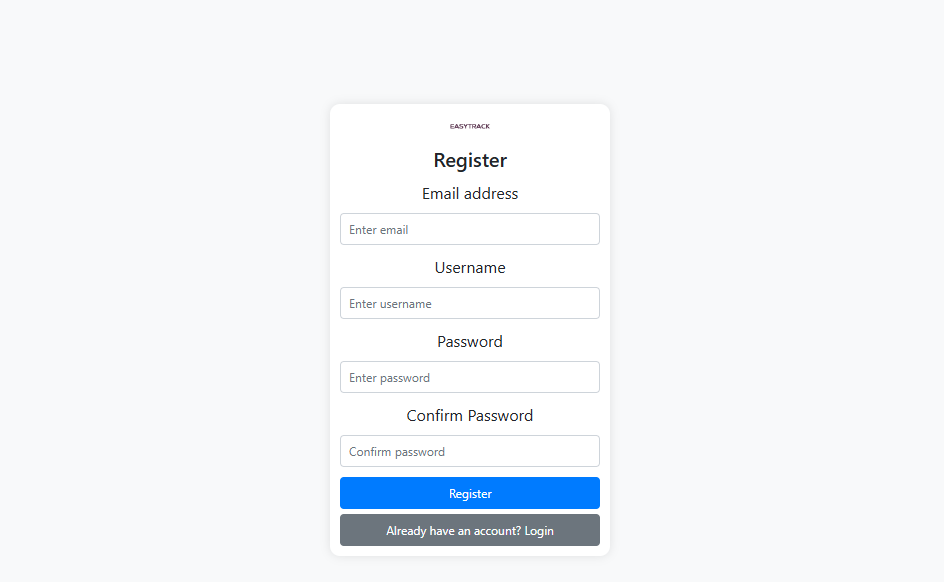
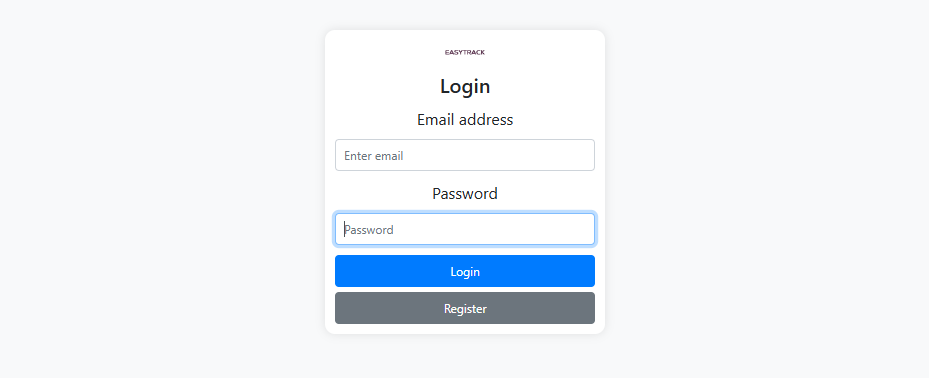
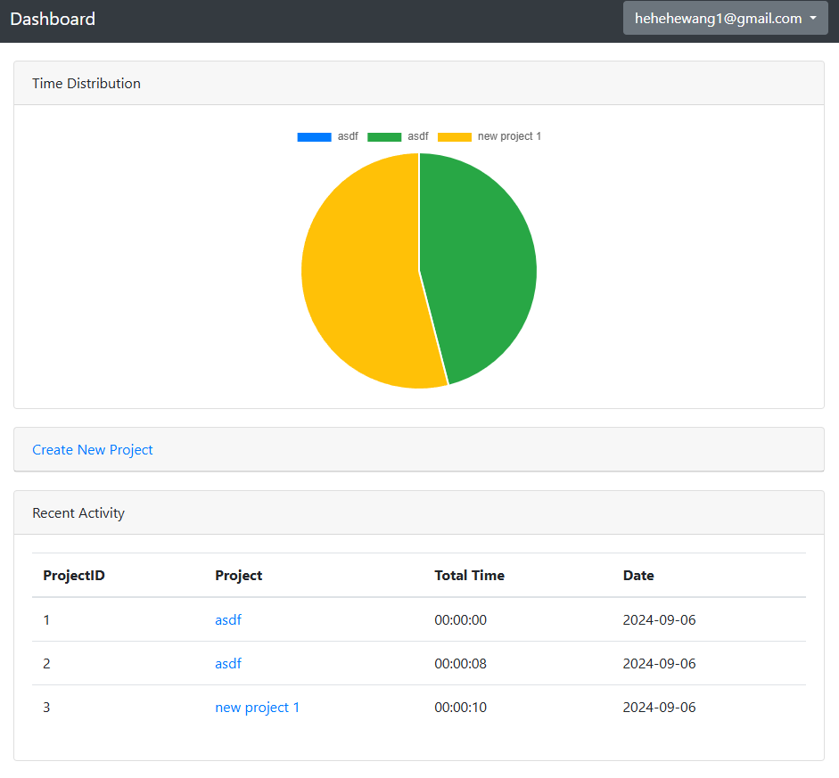
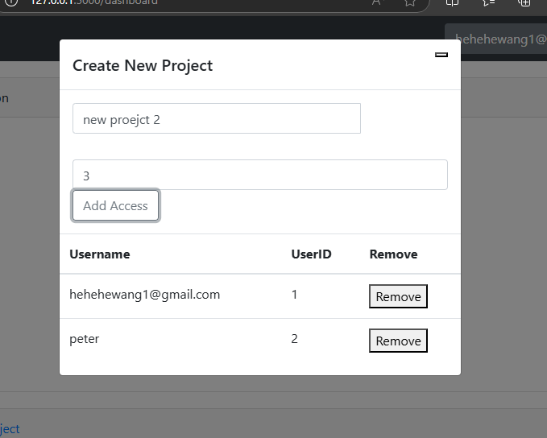
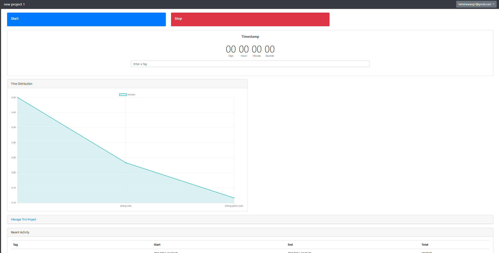
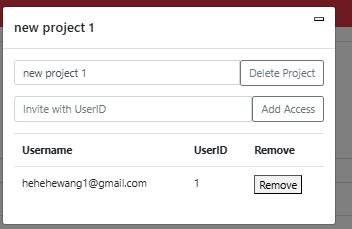

# Reference 

## CLI Commands

### Initialize DB

#### `init_db()`

- **Route:** `flask init-db`
- **Purpose:** 
Initializes db, optionally it also populates the db with mock data.

### Register

#### `drop_db()`

- **Route:** `flask drop-db`
- **Purpose:** 
Drops the current DB

## Routes

### Register

#### `register()`

- **Route:** `/register`
- **Methods:** `POST`, `GET`
- **Purpose:** 
  Renders the register page, containing the logic for the registration process.

- **Sample output:**
  

### Login

#### `login()`

- **Route:** `/login`
- **Methods:** `POST`, `GET`
- **Purpose:** 
  Renders the login page, containing the logic for the login process.

- **Sample output:**
  

### Dashboard

#### `dashboard()`

- **Route:** `/dashboard`
- **Purpose:** 
  Provides the user an overview of their projects and time consumption. Users can also create new projects from this page.

- **Sample output:**
  
  

### Project

#### `/project/(int : project_id)`

- **Route:** `/project/ int: id`
- **Purpose:** 
  Lets the user track their timestamps within a given project. If the user is the owner of the project, they can also manage it. This route also visualizes the time spent on a given project.

- **Sample output:**
  
  

### Timer Control Routes

#### `startTime`; `stopTime`

- **Route:** `/start`, `/stop`
- **Purpose:** 
  These routes are built for the Fetch API to start or stop timers. If the timer was started or stopped successfully, the routes return a JSON containing the success status.

### Loading Timestamps

#### `loadtimestamps(project_id)`

- **Route:** `/load/(int : project_id)`
- **Purpose:** 
  This route is built for the Fetch API to load all timestamps belonging to a certain project. The route returns a JSON containing all timestamps or an error code.

### Loading Collaborators for a Project

#### `access(project_id)`

- **Route:** `/access/(int : project_id)`
- **Purpose:** 
  This route is built for the Fetch API to load all collaborators associated with a project. The route returns a JSON containing all the collaborators or an error code.

### Adding Collaborators for a Project

#### `gainaccess()`

- **Route:** `/gainaccess`
- **Purpose:** 
  This route is built for the Fetch API to add a new user as a collaborator to the project. The route returns a status code indicating whether adding the collaborator was successful.

### Deleting Collaborators for a Project

#### `revokeaccess()`

- **Route:** `/revokeaccess`
- **Purpose:** 
  This route is built for the Fetch API to remove a collaborator from the project. The route returns a status code indicating whether removing the collaborator was successful.

### Create a New Project

#### `create()`

- **Route:** `/create`
- **Purpose:** 
  This route is built for the Fetch API to create a new project. If successful, the route returns the `projectID` of the newly created project.

### Delete a Project

#### `delete()`

- **Route:** `/delete`
- **Purpose:** 
  This route is built for the Fetch API to delete a project. If successful, the route returns a status code indicating success.
